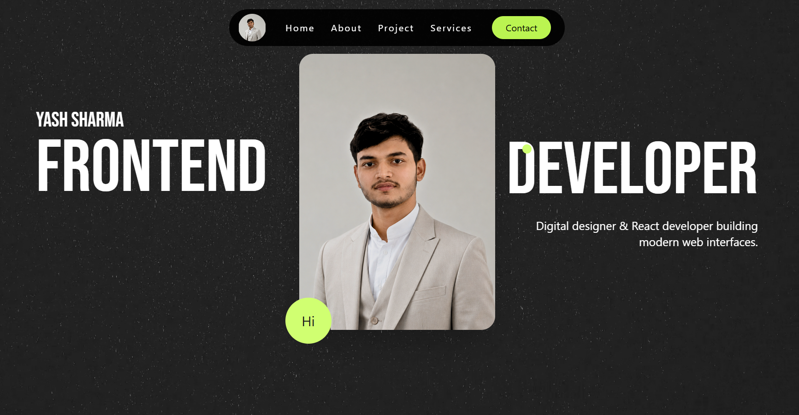

# 🚀 Yash Sharma Portfolio

A modern, responsive, and animation-rich portfolio website built using **React**, **Tailwind CSS**, **GSAP**, and **Vite**.  
This portfolio represents my frontend development skills, creative UI design approach, and interactive web experiences.

The website includes smooth page transitions, advanced animations, custom cursor effects, responsive layouts, and project showcases built with modern frontend technologies.

---

# 🌐 Live Website

🔗 https://yashsharmayy.github.io/MyPortfolio/

---

# 📸 Preview



---

# ✨ Features

## 🎨 Modern UI Design

- Clean and minimal interface
- Creative layouts
- Smooth visual hierarchy
- Modern typography and spacing

---

## ⚡ GSAP Animations

- Scroll-triggered animations
- Smooth page transitions
- Interactive hover effects
- Animated cards and sections
- Loading screen animations

---

## 🖱️ Custom Cursor

- Dynamic animated cursor
- Hover interactions
- Project preview cursor effects

---

## 📱 Fully Responsive

- Mobile-friendly design
- Tablet optimized
- Desktop responsive layouts
- Adaptive typography and spacing

---

## 🚀 Smooth Scrolling

Implemented using **Lenis** for premium smooth scroll experience.

---

## 🧩 Reusable Components

- Navbar
- Buttons
- Project Cards
- Dropdowns
- Animated Sections
- Footer
- Transition Loader

---

## 🌙 Interactive Experience

- Smooth navigation
- Animated menus
- Hover interactions
- Transition effects between pages

---

# 🛠️ Technologies Used

| Technology       | Purpose            |
| ---------------- | ------------------ |
| React.js         | Frontend Framework |
| Tailwind CSS     | Styling            |
| GSAP             | Animations         |
| Vite             | Build Tool         |
| React Router DOM | Routing            |
| Lenis            | Smooth Scrolling   |
| JavaScript       | Functionality      |

---

# 📂 Folder Structure

```bash
src/
│
├── assets/              # Images & Videos
├── components/          # Reusable Components
├── pages/               # Website Pages
│
├── App.jsx
├── main.jsx
└── index.css
```

---

# 📄 Pages Included

- Home
- About
- Projects
- Services
- Contact

---

# 📸 Featured Projects

## 💎 Aurum Luxe

A luxury jewellery website built with React and GSAP featuring premium UI and animations.

### Features:

- Smooth animations
- Responsive design
- Modern luxury aesthetics
- Interactive UI

---

## 🏋️ GYM_BRO

A modern gym website built using React and GSAP with energetic design and smooth transitions.

---

## 🎬 Movie Masalaa

A React movie application where users can search movies and explore details dynamically.

---

## ☕ Coffee Website

A stylish coffee landing page created using HTML, CSS, and JavaScript.

---

## 🌦️ Weather App

A responsive weather application using API integration to display real-time weather data.

---

## 🐍 Snake Game

Classic snake game built using JavaScript with game logic and DOM manipulation.

---

# 📈 Performance Optimizations

- Optimized animations
- Reusable React components
- Efficient rendering
- Responsive image handling
- Smooth scrolling optimization

---

# 🎯 Future Improvements

- Dark/Light theme toggle
- Backend contact form integration
- Blog section
- More interactive animations
- Project filtering system
- CMS integration

---

# 📬 Contact

## 👨‍💻 Yash Sharma

- GitHub: https://github.com/yashsharmayy
- Portfolio: https://yashsharmayy.github.io/MyPortfolio/

---

# ⭐ Credits

Designed and developed by **Yash Sharma** using React, Tailwind CSS, and GSAP.

---

# 📜 License

This project is open source and available under the MIT License.
